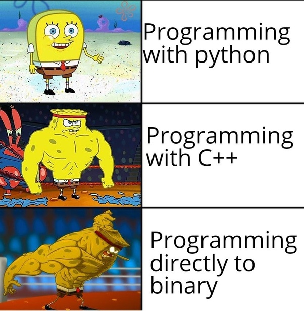

**Quick intro**: The TIOBE Programming Community index is an indicator of the popularity of programming languages. The index is updated once a month. The ratings are based on the number of skilled engineers world-wide, courses and third party vendors.
[MoreInfo]()
